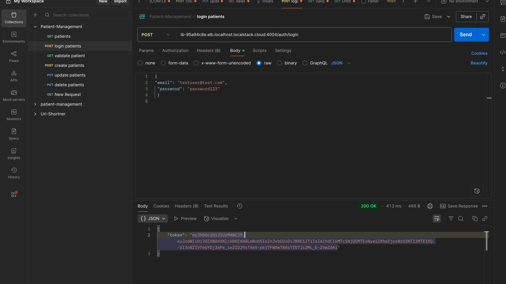

# Healthcare Microservices System


## System Architecture Overview


A comprehensive healthcare management system built with modern microservices architecture, featuring patient management, billing, analytics, and authentication services with full observability, caching, resilience patterns, and AWS cloud integration.

## Table of Contents

* [Core Features](#core-features)
* [Container Ecosystem](#container-ecosystem)
* [Service Architecture](#service-architecture)
* [API Management & Pagination](#api-management--pagination)
* [Caching Strategy](#caching-strategy)
* [Rate Limiting & Security](#rate-limiting--security)
* [Resilience Patterns](#resilience-patterns)
* [Event-Driven Architecture](#event-driven-architecture)
* [Observability & Monitoring](#observability--monitoring)
* [Service Discovery & Cloud](#service-discovery--cloud)
* [API Testing](#api-testing)
* [Docker Deployment](#docker-deployment)
* [Infrastructure & Configuration](#infrastructure--configuration)
* [Getting Started](#getting-started)
* [Detailed Setup Instructions](#detailed-setup-instructions)
  * [Billing Service Setup](#billing-service-setup)
  * [Patient Service Setup](#patient-service-setup)
  * [Notification Service Setup](#notification-service-setup)
  * [Auth Service Setup](#auth-service-setup)
  * [Auth Service DB Setup](#auth-service-db-setup)

## Core Features

* **Microservices Architecture** with Spring Boot 3.2+
* **Advanced Pagination & Sorting** with query parameters
* **Redis Caching** with cache-miss metrics
* **Rate Limiting** at API Gateway level
* **Circuit Breakers** with fallback mechanisms
* **Event-Driven Architecture** with Apache Kafka
* **Comprehensive Observability** with Prometheus & Grafana
* **Service Discovery** using AWS Cloud Map
* **Container Orchestration** with Docker
* **JWT Authentication** with role-based access control
* **Infrastructure as Code** with AWS CDK
* **Production Deployment** with automated CI/CD

## Container Ecosystem


| Service               | Port      | Technology        |
| --------------------- | --------- | ----------------- |
| **Patient Service**   | 4000      | Spring Boot + JPA |
| **Analytics Service** | 4002      | Kafka Consumer    |
| **API Gateway**       | 4004      | Spring Cloud      |
| **Auth Service**      | 4005      | JWT + Security    |
| **Billing Service**   | gRPC:9005 | gRPC Server       |
| **LocalStack**        | 4566/443  | AWS Emulation     |
| **Redis**             | 6379      | Caching Layer     |
| **Kafka**             | 9092      | Message Broker    |
| **Prometheus**        | 9090      | Metrics Collection|
| **Grafana**           | 3000      | Monitoring UI     |

## Service Architecture

### 1. Patient Service (Port: 4000)
**Core healthcare data management with advanced features**

* **Advanced Pagination**: Query parameters for filtering, sorting, and pagination
* **Redis Caching**: Read-through caching with cache-miss metrics
* **gRPC Integration**: Communicates with Billing Service for account creation
* **Event Publishing**: Kafka producer for patient lifecycle events
* **Circuit Breaker**: Resilience patterns for downstream service calls
* **Database**: PostgreSQL with JPA/Hibernate ORM
* **Metrics**: Custom metrics for cache performance and API usage

### 2. API Gateway (Port: 4004)
**Centralized request routing and security**

* **Rate Limiting**: Configurable rate limits per endpoint
* **JWT Validation**: Centralized authentication filter
* **Request Routing**: Load balancing and service discovery
* **Security Policies**: CORS, request validation, and security headers

### 3. Auth Service (Port: 4005)
**Authentication and authorization**

* **JWT Token Management**: Secure token generation and validation
* **Role-Based Access**: ADMIN/USER role management
* **Password Security**: BCrypt hashing
* **User Management**: Registration and profile management

### 4. Billing Service (gRPC Port: 9005)
**High-performance billing operations**

* **gRPC Protocol**: Binary protocol for low-latency communication
* **Circuit Breaker**: Fallback mechanisms for service resilience
* **Event Consumption**: Kafka consumer for billing account events
* **Protocol Buffers**: Efficient serialization

### 5. Analytics Service (Port: 4002)
**Real-time event processing**

* **Kafka Consumer**: Processes patient lifecycle events
* **Event Analytics**: Real-time data processing and insights
* **Scalable Architecture**: Event-driven processing pipeline

## API Management & Pagination



**Advanced Query Parameters:**
```http
GET /api/patients?page=0&size=10&sort=name,asc&email=john@example.com
```

**Standardized Response Format:**
```json
{
  "content": [...],
  "page": 0,
  "size": 10,
  "totalElements": 25,
  "totalPages": 3,
  "sort": ["name,asc"],
  "hasNext": true,
  "hasPrevious": false
}
```

## Caching Strategy

**Redis Integration with Spring Boot:**
* **Read-Through Caching**: Automatic cache population on cache misses
* **Cache-Miss Metrics**: Custom metrics for cache performance monitoring
* **Configurable TTL**: Environment-specific cache expiration
* **Cache Eviction**: Automatic cache invalidation on data updates

## Rate Limiting & Security

**API Gateway Protection:**
* **Per-Endpoint Limits**: Configurable rate limits based on API patterns
* **JWT Validation**: Centralized token validation across all services
* **Request Throttling**: Prevents API abuse and ensures fair usage
* **Security Headers**: CORS, Content Security Policy, and other security measures

## Resilience Patterns

**Circuit Breaker Implementation:**
* **Fallback Mechanisms**: Graceful degradation when services are unavailable
* **Timeout Configuration**: Prevents cascading failures
* **Health Monitoring**: Automatic service health detection
* **Recovery Strategies**: Automatic circuit breaker reset on service recovery

## Event-Driven Architecture

**Kafka Integration:**
* **Patient Lifecycle Events**: Create, update, delete events
* **Billing Account Events**: Automated billing account creation
* **Analytics Processing**: Real-time event processing for insights
* **Reliable Messaging**: Guaranteed message delivery with acknowledgments

## Observability & Monitoring

**Comprehensive monitoring stack with Prometheus and Grafana**

### Prometheus Metrics Collection


**Metrics Collected:**
* **Application Metrics**: JVM, HTTP requests, database connections
* **Custom Business Metrics**: Cache hit/miss ratios, API response times
* **Infrastructure Metrics**: Memory usage, CPU utilization, network I/O
* **Spring Boot Actuator**: Health checks, application info, environment details

### Grafana Dashboards

#### Default Spring Boot Dashboard


**Out-of-the-box monitoring includes:**
* JVM Memory Usage and Garbage Collection
* HTTP Request Metrics and Response Times
* Database Connection Pool Monitoring
* System Resource Utilization

#### Custom Business Metrics Dashboard


**Custom metrics tracking:**
* **Cache Performance**: Cache hit/miss ratios and response times
* **API Usage Patterns**: Endpoint usage statistics and rate limiting
* **Circuit Breaker Status**: Service health and fallback activation
* **Patient Service Metrics**: Custom business logic performance

## Service Discovery & Cloud

**AWS Cloud Map Integration:**
* **Service Discovery**: Dynamic service registration and discovery
* **Load Balancing**: Automatic traffic distribution across healthy instances
* **Health Checks**: Continuous service health monitoring
* **DNS-Based Discovery**: Services resolve each other using Cloud Map URLs

**Production Infrastructure:**
* **Amazon ElastiCache**: Managed Redis service for caching
* **Amazon MSK**: Managed Kafka service for messaging
* **AWS ECS**: Container orchestration and scaling
* **Application Load Balancer**: Traffic routing and SSL termination

## API Testing

### Comprehensive Postman Collection


**Test Coverage:**
* **Patient Management**: CRUD operations with validation
* **Authentication Flow**: Login, token validation, role-based access
* **Pagination Testing**: Various page sizes and sorting options
* **Rate Limiting**: Throttling behavior validation
* **Circuit Breaker**: Fallback mechanism testing

### LocalStack Integration


**AWS Services Emulation:**
* **S3**: Object storage for file uploads and documents
* **SQS/SNS**: Message queuing and notifications
* **DynamoDB**: NoSQL database operations
* **Cloud Map**: Service discovery simulation
* **ElastiCache**: Redis caching service emulation

## Docker Deployment

**Complete containerized microservices stack**

### Docker Compose Configuration

```yaml
version: '3.8'
services:
  patient-service:
    build: ./patient-service
    ports: ["4000:4000"]
    environment:
      - SPRING_DATASOURCE_URL=jdbc:postgresql://patient-db:5432/patientdb
      - SPRING_KAFKA_BOOTSTRAP_SERVERS=kafka:9092
      - SPRING_REDIS_HOST=redis
      - SPRING_REDIS_PORT=6379
      - BILLING_SERVICE_ADDRESS=billing-service
      - BILLING_SERVICE_GRPC_PORT=9005
    depends_on:
      - patient-db
      - redis
      - kafka

  api-gateway:
    build: ./api-gateway
    ports: ["4004:4004"]
    depends_on:
      - patient-service
      - auth-service

  auth-service:
    build: ./auth-service
    ports: ["4005:4005"]
    depends_on:
      - auth-db

  analytics-service:
    build: ./analytics-service
    ports: ["4002:4002"]
    depends_on:
      - kafka

  billing-service:
    build: ./billing-service
    ports: ["9005:9005"]
    depends_on:
      - kafka

  # Infrastructure Services
  redis:
    image: redis:7-alpine
    ports: ["6379:6379"]
    command: redis-server --appendonly yes

  kafka:
    image: confluentinc/cp-kafka:latest
    ports: ["9092:9092", "9094:9094"]
    environment:
      KAFKA_CFG_ADVERTISED_LISTENERS: PLAINTEXT://kafka:9092,EXTERNAL://localhost:9094
      KAFKA_CFG_LISTENERS: PLAINTEXT://:9092,CONTROLLER://:9093,EXTERNAL://:9094

  prometheus:
    build: ./monitoring
    ports: ["9090:9090"]
    volumes:
      - ./monitoring/prometheus.yml:/etc/prometheus/prometheus.yml

  grafana:
    image: grafana/grafana:latest
    ports: ["3000:3000"]
    environment:
      - GF_SECURITY_ADMIN_PASSWORD=admin
    volumes:
      - grafana-storage:/var/lib/grafana

  localstack:
    image: localstack/localstack:latest
    ports: ["4566:4566", "443:443"]
    environment:
      - SERVICES=s3,sqs,sns,dynamodb,cloudmap,elasticache
      - DEBUG=1
```

### Container Health and Management

**Service Dependencies:**
* Database containers start before application services
* Infrastructure services (Redis, Kafka) initialize before dependent services
* Health checks ensure services are ready before routing traffic
* Graceful shutdown handling for clean container stops

## Infrastructure & Configuration

### Technology Stack

**Core Technologies:**
* **Java 17+** - Modern Java features and performance improvements
* **Spring Boot 3.2+** - Enterprise application framework
* **PostgreSQL 15** - Primary relational database
* **Redis 7** - In-memory caching and session storage
* **Apache Kafka 3.4** - Event streaming platform
* **Docker & Docker Compose** - Containerization platform
* **Maven 3.6+** - Build automation and dependency management

### Environment Configuration

**Patient Service Environment:**
```bash
# Database Configuration
SPRING_DATASOURCE_URL=jdbc:postgresql://patient-service-db:5432/db
SPRING_DATASOURCE_USERNAME=admin_user
SPRING_DATASOURCE_PASSWORD=password
SPRING_JPA_HIBERNATE_DDL_AUTO=update

# Messaging Configuration
SPRING_KAFKA_BOOTSTRAP_SERVERS=kafka:9092

# Caching Configuration
SPRING_REDIS_HOST=redis
SPRING_REDIS_PORT=6379

# Service Communication
BILLING_SERVICE_ADDRESS=billing-service
BILLING_SERVICE_GRPC_PORT=9005

# Development Tools
JAVA_TOOL_OPTIONS=-agentlib:jdwp=transport=dt_socket,server=y,suspend=n,address=*:5005
```

**Kafka Configuration:**
```bash
KAFKA_CFG_ADVERTISED_LISTENERS=PLAINTEXT://kafka:9092,EXTERNAL://localhost:9094
KAFKA_CFG_CONTROLLER_LISTENER_NAMES=CONTROLLER
KAFKA_CFG_CONTROLLER_QUORUM_VOTERS=0@kafka:9093
KAFKA_CFG_LISTENER_SECURITY_PROTOCOL_MAP=CONTROLLER:PLAINTEXT,EXTERNAL:PLAINTEXT,PLAINTEXT:PLAINTEXT
KAFKA_CFG_LISTENERS=PLAINTEXT://:9092,CONTROLLER://:9093,EXTERNAL://:9094
KAFKA_CFG_NODE_ID=0
KAFKA_CFG_PROCESS_ROLES=controller,broker
```

### Security Configuration

**Authentication & Authorization:**
* **JWT Token Management** with configurable expiration
* **BCrypt Password Hashing** with salt rounds
* **Role-Based Access Control** (ADMIN/USER)
* **CORS Configuration** for cross-origin requests

**Database Security:**
```sql
-- Default admin user setup
INSERT INTO "users" (id, email, password, role)
SELECT '223e4567-e89b-12d3-a456-426614174006', 
       'testuser@test.com',
       '$2b$12$7hoRZfJrRKD2nIm2vHLs7OBETy.LWenXXMLKf99W8M4PUwO6KB7fu', 
       'ADMIN'
WHERE NOT EXISTS (SELECT 1 FROM "users" WHERE email = 'testuser@test.com');
```

## Getting Started

### Prerequisites
* **Java 17 or higher**
* **Docker Desktop** with Docker Compose
* **Maven 3.6+** for building services
* **Git** for version control
* **Postman** (optional) for API testing

### Quick Start Commands

1. **Clone the Repository:**
   ```bash
   git clone <repository-url>
   cd patient-management
   ```

2. **Build All Services:**
   ```bash
   mvn clean package -DskipTests
   ```

3. **Start Infrastructure Services:**
   ```bash
   docker-compose up -d redis kafka prometheus grafana localstack
   ```

4. **Start Application Services:**
   ```bash
   docker-compose up -d
   ```

5. **Verify Services:**
   ```bash
   # Check service health
   curl http://localhost:4000/actuator/health
   curl http://localhost:4004/actuator/health
   curl http://localhost:4005/actuator/health
   ```

6. **Access Monitoring:**
   * **Grafana Dashboard:** http://localhost:3000 (admin/admin)
   * **Prometheus UI:** http://localhost:9090
   * **LocalStack Dashboard:** http://localhost:4566

### Testing the System

1. **Authenticate:**
   ```bash
   curl -X POST http://localhost:4004/auth/login \
     -H "Content-Type: application/json" \
     -d '{"email":"testuser@test.com","password":"password123"}'
   ```

2. **Create Patient:**
   ```bash
   curl -X POST http://localhost:4004/api/patients \
     -H "Authorization: Bearer <token>" \
     -H "Content-Type: application/json" \
     -d '{"name":"John Doe","email":"john@example.com","address":"123 Main St","dateOfBirth":"1990-01-01"}'
   ```

3. **Query with Pagination:**
   ```bash
   curl "http://localhost:4004/api/patients?page=0&size=10&sort=name,asc"
   ```

### Production Deployment

**AWS Infrastructure Setup:**
```bash
# Deploy infrastructure with CDK
cd infrastructure
mvn compile exec:java -Dexec.mainClass="com.pm.stack.LocalStack"

# Build and push Docker images
./build-images.sh

# Deploy services
./deploy.sh
```

**Monitoring Setup:**
* Prometheus automatically discovers and scrapes service metrics
* Grafana dashboards are pre-configured for Spring Boot applications
* Custom business metrics are available for cache performance and API usage

---

**Copyright © 2025 Sandip Mandal**

*This healthcare microservices system demonstrates enterprise-grade patterns including observability, resilience, caching, and event-driven architecture. The system is designed for production deployment with comprehensive monitoring, security, and scalability features.*

---

## Detailed Setup Instructions

## Environment Variables

```
JAVA_TOOL_OPTIONS=-agentlib:jdwp=transport=dt_socket,server=y,suspend=n,address=*:5005;
SPRING_DATASOURCE_PASSWORD=password;
SPRING_DATASOURCE_URL=jdbc:postgresql://patient-service-db:5432/db;
SPRING_DATASOURCE_USERNAME=admin_user;
SPRING_JPA_HIBERNATE_DDL_AUTO=update;
SPRING_KAFKA_BOOTSTRAP_SERVERS=kafka:9092;
SPRING_SQL_INIT_MODE=always
```

## Billing Service Setup

### gRPC Setup

Add the following to the `<dependencies>` section
```
<!--GRPC -->
<dependency>
    <groupId>io.grpc</groupId>
    <artifactId>grpc-netty-shaded</artifactId>
    <version>1.69.0</version>
</dependency>
<dependency>
    <groupId>io.grpc</groupId>
    <artifactId>grpc-protobuf</artifactId>
    <version>1.69.0</version>
</dependency>
<dependency>
    <groupId>io.grpc</groupId>
    <artifactId>grpc-stub</artifactId>
    <version>1.69.0</version>
</dependency>
<dependency> <!-- necessary for Java 9+ -->
    <groupId>org.apache.tomcat</groupId>
    <artifactId>annotations-api</artifactId>
    <version>6.0.53</version>
    <scope>provided</scope>
</dependency>
<dependency>
    <groupId>net.devh</groupId>
    <artifactId>grpc-spring-boot-starter</artifactId>
    <version>3.1.0.RELEASE</version>
</dependency>
<dependency>
    <groupId>com.google.protobuf</groupId>
    <artifactId>protobuf-java</artifactId>
    <version>4.29.1</version>
</dependency>

```

Replace the `<build>` section with the following

```

<build>
    <extensions>
        <!-- Ensure OS compatibility for protoc -->
        <extension>
            <groupId>kr.motd.maven</groupId>
            <artifactId>os-maven-plugin</artifactId>
            <version>1.7.0</version>
        </extension>
    </extensions>
    <plugins>
        <!-- Spring boot / maven  -->
        <plugin>
            <groupId>org.springframework.boot</groupId>
            <artifactId>spring-boot-maven-plugin</artifactId>
        </plugin>

        <!-- PROTO -->
        <plugin>
            <groupId>org.xolstice.maven.plugins</groupId>
            <artifactId>protobuf-maven-plugin</artifactId>
            <version>0.6.1</version>
            <configuration>
                <protocArtifact>com.google.protobuf:protoc:3.25.5:exe:${os.detected.classifier}</protocArtifact>
                <pluginId>grpc-java</pluginId>
                <pluginArtifact>io.grpc:protoc-gen-grpc-java:1.68.1:exe:${os.detected.classifier}</pluginArtifact>
            </configuration>
            <executions>
                <execution>
                    <goals>
                        <goal>compile</goal>
                        <goal>compile-custom</goal>
                    </goals>
                </execution>
            </executions>
        </plugin>
    </plugins>
</build>

```

## Patient Service Setup

### Environment Variables (complete list)
```bash
BILLING_SERVICE_ADDRESS=billing-service;
BILLING_SERVICE_GRPC_PORT=9005;
JAVA_TOOL_OPTIONS=-agentlib:jdwp\=transport\=dt_socket,server\=y,suspend\=n,address\=*:5005;
SPRING_DATASOURCE_PASSWORD=password;
SPRING_DATASOURCE_URL=jdbc:postgresql://patient-service-db:5432/db;
SPRING_DATASOURCE_USERNAME=admin_user;
SPRING_JPA_HIBERNATE_DDL_AUTO=update;
SPRING_KAFKA_BOOTSTRAP_SERVERS=kafka:9092;
SPRING_SQL_INIT_MODE=always
```


### gRPC Setup

Add the following to the `<dependencies>` section
```
<!--GRPC -->
<dependency>
    <groupId>io.grpc</groupId>
    <artifactId>grpc-netty-shaded</artifactId>
    <version>1.69.0</version>
</dependency>
<dependency>
    <groupId>io.grpc</groupId>
    <artifactId>grpc-protobuf</artifactId>
    <version>1.69.0</version>
</dependency>
<dependency>
    <groupId>io.grpc</groupId>
    <artifactId>grpc-stub</artifactId>
    <version>1.69.0</version>
</dependency>
<dependency> <!-- necessary for Java 9+ -->
    <groupId>org.apache.tomcat</groupId>
    <artifactId>annotations-api</artifactId>
    <version>6.0.53</version>
    <scope>provided</scope>
</dependency>
<dependency>
    <groupId>net.devh</groupId>
    <artifactId>grpc-spring-boot-starter</artifactId>
    <version>3.1.0.RELEASE</version>
</dependency>
<dependency>
    <groupId>com.google.protobuf</groupId>
    <artifactId>protobuf-java</artifactId>
    <version>4.29.1</version>
</dependency>

```

Replace the `<build>` section with the following

```

<build>
    <extensions>
        <!-- Ensure OS compatibility for protoc -->
        <extension>
            <groupId>kr.motd.maven</groupId>
            <artifactId>os-maven-plugin</artifactId>
            <version>1.7.0</version>
        </extension>
    </extensions>
    <plugins>
        <!-- Spring boot / maven  -->
        <plugin>
            <groupId>org.springframework.boot</groupId>
            <artifactId>spring-boot-maven-plugin</artifactId>
        </plugin>

        <!-- PROTO -->
        <plugin>
            <groupId>org.xolstice.maven.plugins</groupId>
            <artifactId>protobuf-maven-plugin</artifactId>
            <version>0.6.1</version>
            <configuration>
                <protocArtifact>com.google.protobuf:protoc:3.25.5:exe:${os.detected.classifier}</protocArtifact>
                <pluginId>grpc-java</pluginId>
                <pluginArtifact>io.grpc:protoc-gen-grpc-java:1.68.1:exe:${os.detected.classifier}</pluginArtifact>
            </configuration>
            <executions>
                <execution>
                    <goals>
                        <goal>compile</goal>
                        <goal>compile-custom</goal>
                    </goals>
                </execution>
            </executions>
        </plugin>
    </plugins>
</build>

```

### Kafka Container

Copy/paste this line into the environment variables when running the container in intellij
```
KAFKA_CFG_ADVERTISED_LISTENERS=PLAINTEXT://kafka:9092,EXTERNAL://localhost:9094;KAFKA_CFG_CONTROLLER_LISTENER_NAMES=CONTROLLER;KAFKA_CFG_CONTROLLER_QUORUM_VOTERS=0@kafka:9093;KAFKA_CFG_LISTENER_SECURITY_PROTOCOL_MAP=CONTROLLER:PLAINTEXT,EXTERNAL:PLAINTEXT,PLAINTEXT:PLAINTEXT;KAFKA_CFG_LISTENERS=PLAINTEXT://:9092,CONTROLLER://:9093,EXTERNAL://:9094;KAFKA_CFG_NODE_ID=0;KAFKA_CFG_PROCESS_ROLES=controller,broker
```

### Kafka Producer Setup (Patient Service)

Add the following to `application.properties`
```
spring.kafka.consumer.key-deserializer=org.apache.kafka.common.serialization.StringDeserializer
spring.kafka.consumer.value-deserializer=org.apache.kafka.common.serialization.ByteArrayDeserializer
```


## Notification Service Setup

### Environment Vars

```
SPRING_KAFKA_BOOTSTRAP_SERVERS=kafka:9092
```

### Protobuf/Kafka 

Dependencies (add in addition to whats there)

```
<dependency>
    <groupId>org.springframework.kafka</groupId>
    <artifactId>spring-kafka</artifactId>
    <version>3.3.0</version>
</dependency>

<dependency>
    <groupId>com.google.protobuf</groupId>
    <artifactId>protobuf-java</artifactId>
    <version>4.29.1</version>
</dependency>
```

Update the build section in pom.xml with the following

```
    <build>
        <extensions>
            <!-- Ensure OS compatibility for protoc -->
            <extension>
                <groupId>kr.motd.maven</groupId>
                <artifactId>os-maven-plugin</artifactId>
                <version>1.7.0</version>
            </extension>
        </extensions>
        <plugins>
            <plugin>
                <groupId>org.springframework.boot</groupId>
                <artifactId>spring-boot-maven-plugin</artifactId>
            </plugin>

            <plugin>
                <groupId>org.xolstice.maven.plugins</groupId>
                <artifactId>protobuf-maven-plugin</artifactId>
                <version>0.6.1</version>
                <configuration>
                    <protocArtifact>com.google.protobuf:protoc:3.25.5:exe:${os.detected.classifier}</protocArtifact>
                    <pluginId>grpc-java</pluginId>
                    <pluginArtifact>io.grpc:protoc-gen-grpc-java:1.68.1:exe:${os.detected.classifier}</pluginArtifact>
                </configuration>
                <executions>
                    <execution>
                        <goals>
                            <goal>compile</goal>
                            <goal>compile-custom</goal>
                        </goals>
                    </execution>
                </executions>
            </plugin>
        </plugins>
    </build>
```


## Auth Service Setup {#auth-service-setup}

### Dependencies

Dependencies (add in addition to whats there)

```
        <dependency>
            <groupId>org.springframework.boot</groupId>
            <artifactId>spring-boot-starter-security</artifactId>
        </dependency>

        <dependency>
            <groupId>org.springframework.boot</groupId>
            <artifactId>spring-boot-starter-data-jpa</artifactId>
        </dependency>
        <dependency>
            <groupId>org.springframework.boot</groupId>
            <artifactId>spring-boot-starter-web</artifactId>
        </dependency>
        <dependency>
            <groupId>org.springframework.boot</groupId>
            <artifactId>spring-boot-starter-test</artifactId>
            <scope>test</scope>
        </dependency>
        <dependency>
            <groupId>org.springframework.security</groupId>
            <artifactId>spring-security-test</artifactId>
            <scope>test</scope>
        </dependency>
        <dependency>
            <groupId>io.jsonwebtoken</groupId>
            <artifactId>jjwt-api</artifactId>
            <version>0.12.6</version>
        </dependency>
        <dependency>
            <groupId>io.jsonwebtoken</groupId>
            <artifactId>jjwt-impl</artifactId>
            <version>0.12.6</version>
            <scope>runtime</scope>
        </dependency>
        <dependency>
            <groupId>io.jsonwebtoken</groupId>
            <artifactId>jjwt-jackson</artifactId>
            <version>0.12.6</version>
            <scope>runtime</scope>
        </dependency>
        <dependency>
            <groupId>org.postgresql</groupId>
            <artifactId>postgresql</artifactId>
            <scope>runtime</scope>
        </dependency>
        <dependency>
            <groupId>org.springdoc</groupId>
            <artifactId>springdoc-openapi-starter-webmvc-ui</artifactId>
            <version>2.6.0</version>
        </dependency>
        <dependency>
          <groupId>com.h2database</groupId>
          <artifactId>h2</artifactId>
        </dependency>
       
```

### Environment Variables

```
SPRING_DATASOURCE_PASSWORD=password
SPRING_DATASOURCE_URL=jdbc:postgresql://auth-service-db:5432/db
SPRING_DATASOURCE_USERNAME=admin_user
SPRING_JPA_HIBERNATE_DDL_AUTO=update
SPRING_SQL_INIT_MODE=always
```


### Data.sql

```sql
-- Ensure the 'users' table exists
CREATE TABLE IF NOT EXISTS "users" (
    id UUID PRIMARY KEY,
    email VARCHAR(255) UNIQUE NOT NULL,
    password VARCHAR(255) NOT NULL,
    role VARCHAR(50) NOT NULL
);

-- Insert the user if no existing user with the same id or email exists
INSERT INTO "users" (id, email, password, role)
SELECT '223e4567-e89b-12d3-a456-426614174006', 'testuser@test.com',
       '$2b$12$7hoRZfJrRKD2nIm2vHLs7OBETy.LWenXXMLKf99W8M4PUwO6KB7fu', 'ADMIN'
WHERE NOT EXISTS (
    SELECT 1
    FROM "users"
    WHERE id = '223e4567-e89b-12d3-a456-426614174006'
       OR email = 'testuser@test.com'
);


```


## Auth Service DB Setup {#auth-service-db-setup}

### Environment Variables

```
POSTGRES_DB=db;POSTGRES_PASSWORD=password;POSTGRES_USER=admin_user
```
