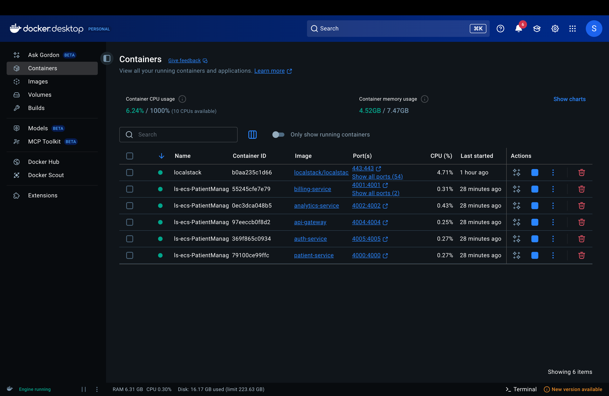

# Healthcare Microservices System


## Table of Contents

- [System Architecture Overview](#system-architecture-overview)
- [Project Overview](#project-overview)
- [Detailed Architecture](#detailed-architecture)
- [Quick Start](#quick-start)
- [Technical Implementation](#technical-implementation)
- [Service Architecture Details](#service-architecture-details)
- [Docker Deployment Architecture](#docker-deployment-architecture)
- [API Testing with Postman](#api-testing-with-postman)
- [Testing Strategy](#testing-strategy)
- [AWS Cloud Integration](#aws-cloud-integration)
- [Security Architecture](#security-architecture)
- [Performance Optimization](#performance-optimization)
- [Monitoring & Analytics](#monitoring--analytics)
- [Service Configurations](#service-configurations)
    - [Patient Service Setup](#patient-service-setup)
    - [Billing Service gRPC Setup](#billing-service-grpc-setup)
    - [Kafka Configuration](#kafka-configuration)
    - [Notification Service Setup](#notification-service-setup)
    - [Auth Service Setup](#auth-service-setup)
    - [Database Configuration](#database-configuration)

## System Architecture Overview


## Project Overview

A comprehensive healthcare management system built with modern microservices architecture, featuring patient management, billing, analytics, and authentication services with full AWS cloud integration.

### Key Features
- **Microservices Architecture** with Spring Boot
- **Inter-service Communication** using gRPC and REST APIs
- **Event-Driven Architecture** with Apache Kafka
- **API Gateway** implementation with routing and security
- **JWT-based Authentication** system with role-based access
- **Docker Containerization** for all services
- **AWS LocalStack** for local cloud development
- **Postman Collections** for API testing
- **Infrastructure as Code** with CloudFormation

## Detailed Architecture

### Container Ecosystem




| Service | Port |
|---------|------|
| **LocalStack** | 4566/443 |
| **Billing Service** | gRPC:9005 |
| **Analytics Service** | 4002 |
| **API Gateway** | 4004 |
| **Auth Service** | 4005 |
| **Patient Service** | 4000 |

## Quick Start

### Prerequisites
- **Java 17+**
- **Docker & Docker Compose**
- **Maven 3.6+**
- **PostgreSQL**
- **LocalStack** (for AWS emulation)
- **Postman** (for API testing)

## Service Architecture Details

### 1. Patient Service (Port:4000)
- **Purpose**: Manages patient records and data
- **Database**: PostgreSQL with JPA/Hibernate
- **Features**:
    - RESTful CRUD endpoints
    - gRPC client for billing communication
    - Kafka producer for analytics events
    - Request validation and error handling

### 2. Billing Service (gRPC Port:9005)
- **Purpose**: Handles billing operations and transactions
- **Communication**: gRPC server implementation
- **Protocol**: Protocol Buffers for efficient binary serialization

### 3. Analytics Service (Port:4002)
- **Purpose**: Real-time data processing and analytics
- **Technology**: Kafka consumer for patient events
- **Features**: Event-driven architecture for scalable processing

### 4. Auth Service (Port:4005)
- **Purpose**: Authentication and authorization
- **Security**: JWT tokens with Spring Security
- **Features**:
    - User management with role-based access
    - Password encryption with BCrypt
    - Token validation endpoint

### 5. API Gateway (Port:4004)
- **Purpose**: Centralized API management
- **Features**:
    - Request routing and load balancing
    - JWT validation filter
    - Rate limiting and security
    - Request/response transformation

### 6. LocalStack Integration


- **Purpose**: AWS services emulation
- **Services**: S3, SQS, SNS, DynamoDB, etc.
- **Usage**: Local development and testing

## Docker Deployment Architecture

```yaml
version: '3.8'
services:
  patient-service:
    build: ./patient-service
    ports: ["4000:4000"]
    environment:
      - SPRING_DATASOURCE_URL=jdbc:postgresql://patient-db:5432/patientdb
      - SPRING_KAFKA_BOOTSTRAP_SERVERS=kafka:9092
  
  api-gateway:
    build: ./api-gateway
    ports: ["4004:4004"]
    
  auth-service:
    build: ./auth-service
    ports: ["4005:4005"]
    
  analytics-service:
    build: ./analytics-service
    ports: ["4002:4002"]
    
  billing-service:
    build: ./billing-service
    ports: ["9005:9005"]
    
  kafka:
    image: confluentinc/cp-kafka:latest
    environment:
      KAFKA_CFG_ADVERTISED_LISTENERS: PLAINTEXT://kafka:9092,EXTERNAL://localhost:9094
  
  localstack:
    image: localstack/localstack
    ports: ["4566:4566", "443:443"]
```

## API Testing with Postman


### Patient Management Collection


**Endpoints Tested:**
- `GET /api/patients` - Retrieve all patients
- `POST /api/patients` - Create new patient
- `PUT /api/patients/{id}` - Update patient
- `DELETE /api/patients/{id}` - Delete patient
- Authentication endpoints

**Sample Response:**
```json
[
  {
    "id": "12364567-699b-1265-a656-4266A4176099",
    "name": "John Doe",
    "email": "john-dee@example.com",
    "address": "123 Main St, Springfield",
    "dateOfBirth": "1995-06-15"
  }
]
```

## Testing Strategy

### Integration Tests
- **Service-to-service communication** testing
- **Database integration** tests
- **Kafka producer/consumer** tests
- **gRPC client-server** testing
- **API Gateway routing** tests

### Example Test Setup:
```java
@SpringBootTest
@AutoConfigureMockMvc
class PatientIntegrationTests {
    
    @Test
    void shouldCreatePatientAndGenerateBill() {
        // Test implementation with gRPC mock
    }
    
    @Test
    void shouldPublishPatientCreatedEvent() {
        // Test Kafka event publishing
    }
}
```

## AWS Cloud Integration

### LocalStack Configuration
- **Version**: 4.7.1.dev73148b6f3
- **Runtime**: Continuous operation
- **Services**: Full AWS stack emulation

### Infrastructure as Code
- **VPC setup** with networking
- **RDS databases** for each service
- **MSK** (Managed Kafka) cluster
- **ECS cluster** for container orchestration
- **Application Load Balancer** configuration

## Security Architecture

- **JWT-based authentication** with secure tokens
- **Password encryption** with BCrypt hashing
- **Role-based access control** (ADMIN/USER roles)
- **Secure inter-service communication** with gRPC TLS
- **API Gateway security filters** for request validation

## Performance Optimization

- **gRPC** for high-performance service communication
- **Kafka** for scalable event processing
- **Database connection pooling** with HikariCP
- **Caching strategies** with Redis
- **Load-balanced microservices** with ECS

## Monitoring & Analytics

- **Real-time patient event tracking**
- **Billing analytics** and reporting
- **Service health monitoring** with Spring Boot Actuator
- **Performance metrics collection** with Micrometer
- **API usage analytics** through Gateway logs

## Service Configurations

### Patient Service Setup


#### Environment Variables
```
JAVA_TOOL_OPTIONS=-agentlib:jdwp=transport=dt_socket,server=y,suspend=n,address=*:5005;
SPRING_DATASOURCE_PASSWORD=password;
SPRING_DATASOURCE_URL=jdbc:postgresql://patient-service-db:5432/db;
SPRING_DATASOURCE_USERNAME=admin_user;
SPRING_JPA_HIBERNATE_DDL_AUTO=update;
SPRING_KAFKA_BOOTSTRAP_SERVERS=kafka:9092;
SPRING_SQL_INIT_MODE=always
```

#### Complete Environment Variables
```bash
BILLING_SERVICE_ADDRESS=billing-service;
BILLING_SERVICE_GRPC_PORT=9005;
JAVA_TOOL_OPTIONS=-agentlib:jdwp\=transport\=dt_socket,server\=y,suspend\=n,address\=*:5005;
SPRING_DATASOURCE_PASSWORD=password;
SPRING_DATASOURCE_URL=jdbc:postgresql://patient-service-db:5432/db;
SPRING_DATASOURCE_USERNAME=admin_user;
SPRING_JPA_HIBERNATE_DDL_AUTO=update;
SPRING_KAFKA_BOOTSTRAP_SERVERS=kafka:9092;
SPRING_SQL_INIT_MODE=always
```

### Billing Service gRPC Setup


#### Dependencies
```xml
<!--GRPC -->
<dependency>
    <groupId>io.grpc</groupId>
    <artifactId>grpc-netty-shaded</artifactId>
    <version>1.69.0</version>
</dependency>
<dependency>
    <groupId>io.grpc</groupId>
    <artifactId>grpc-protobuf</artifactId>
    <version>1.69.0</version>
</dependency>
<dependency>
    <groupId>io.grpc</groupId>
    <artifactId>grpc-stub</artifactId>
    <version>1.69.0</version>
</dependency>
<dependency> <!-- necessary for Java 9+ -->
    <groupId>org.apache.tomcat</groupId>
    <artifactId>annotations-api</artifactId>
    <version>6.0.53</version>
    <scope>provided</scope>
</dependency>
<dependency>
    <groupId>net.devh</groupId>
    <artifactId>grpc-spring-boot-starter</artifactId>
    <version>3.1.0.RELEASE</version>
</dependency>
<dependency>
    <groupId>com.google.protobuf</groupId>
    <artifactId>protobuf-java</artifactId>
    <version>4.29.1</version>
</dependency>
```

#### Build Configuration
```xml
<build>
    <extensions>
        <extension>
            <groupId>kr.motd.maven</groupId>
            <artifactId>os-maven-plugin</artifactId>
            <version>1.7.0</version>
        </extension>
    </extensions>
    <plugins>
        <plugin>
            <groupId>org.springframework.boot</groupId>
            <artifactId>spring-boot-maven-plugin</artifactId>
        </plugin>
        <plugin>
            <groupId>org.xolstice.maven.plugins</groupId>
            <artifactId>protobuf-maven-plugin</artifactId>
            <version>0.6.1</version>
            <configuration>
                <protocArtifact>com.google.protobuf:protoc:3.25.5:exe:${os.detected.classifier}</protocArtifact>
                <pluginId>grpc-java</pluginId>
                <pluginArtifact>io.grpc:protoc-gen-grpc-java:1.68.1:exe:${os.detected.classifier}</pluginArtifact>
            </configuration>
            <executions>
                <execution>
                    <goals>
                        <goal>compile</goal>
                        <goal>compile-custom</goal>
                    </goals>
                </execution>
            </executions>
        </plugin>
    </plugins>
</build>
```

### Kafka Configuration


#### Container Environment Variables
```
KAFKA_CFG_ADVERTISED_LISTENERS=PLAINTEXT://kafka:9092,EXTERNAL://localhost:9094;KAFKA_CFG_CONTROLLER_LISTENER_NAMES=CONTROLLER;KAFKA_CFG_CONTROLLER_QUORUM_VOTERS=0@kafka:9093;KAFKA_CFG_LISTENER_SECURITY_PROTOCOL_MAP=CONTROLLER:PLAINTEXT,EXTERNAL:PLAINTEXT,PLAINTEXT:PLAINTEXT;KAFKA_CFG_LISTENERS=PLAINTEXT://:9092,CONTROLLER://:9093,EXTERNAL://:9094;KAFKA_CFG_NODE_ID=0;KAFKA_CFG_PROCESS_ROLES=controller,broker
```

#### Producer Configuration
```properties
spring.kafka.consumer.key-deserializer=org.apache.kafka.common.serialization.StringDeserializer
spring.kafka.consumer.value-deserializer=org.apache.kafka.common.serialization.ByteArrayDeserializer
```

### Notification Service Setup

#### Environment Variables
```
SPRING_KAFKA_BOOTSTRAP_SERVERS=kafka:9092
```

#### Dependencies
```xml
<dependency>
    <groupId>org.springframework.kafka</groupId>
    <artifactId>spring-kafka</artifactId>
    <version>3.3.0</version>
</dependency>
<dependency>
    <groupId>com.google.protobuf</groupId>
    <artifactId>protobuf-java</artifactId>
    <version>4.29.1</version>
</dependency>
```

### Auth Service Setup


#### Dependencies
```xml
<dependency>
    <groupId>org.springframework.boot</groupId>
    <artifactId>spring-boot-starter-security</artifactId>
</dependency>
<dependency>
    <groupId>org.springframework.boot</groupId>
    <artifactId>spring-boot-starter-data-jpa</artifactId>
</dependency>
<dependency>
    <groupId>org.springframework.boot</groupId>
    <artifactId>spring-boot-starter-web</artifactId>
</dependency>
<dependency>
    <groupId>org.springframework.boot</groupId>
    <artifactId>spring-boot-starter-test</artifactId>
    <scope>test</scope>
</dependency>
<dependency>
    <groupId>org.springframework.security</groupId>
    <artifactId>spring-security-test</artifactId>
    <scope>test</scope>
</dependency>
<dependency>
    <groupId>io.jsonwebtoken</groupId>
    <artifactId>jjwt-api</artifactId>
    <version>0.12.6</version>
</dependency>
<dependency>
    <groupId>io.jsonwebtoken</groupId>
    <artifactId>jjwt-impl</artifactId>
    <version>0.12.6</version>
    <scope>runtime</scope>
</dependency>
<dependency>
    <groupId>io.jsonwebtoken</groupId>
    <artifactId>jjwt-jackson</artifactId>
    <version>0.12.6</version>
    <scope>runtime</scope>
</dependency>
<dependency>
    <groupId>org.postgresql</groupId>
    <artifactId>postgresql</artifactId>
    <scope>runtime</scope>
</dependency>
<dependency>
    <groupId>org.springdoc</groupId>
    <artifactId>springdoc-openapi-starter-webmvc-ui</artifactId>
    <version>2.6.0</version>
</dependency>
<dependency>
    <groupId>com.h2database</groupId>
    <artifactId>h2</artifactId>
</dependency>
```

#### Environment Variables
```
SPRING_DATASOURCE_PASSWORD=password
SPRING_DATASOURCE_URL=jdbc:postgresql://auth-service-db:5432/db
SPRING_DATASOURCE_USERNAME=admin_user
SPRING_JPA_HIBERNATE_DDL_AUTO=update
SPRING_SQL_INIT_MODE=always
```

### Database Configuration


### Data.Sql

```sql
-- Ensure the 'users' table exists
CREATE TABLE IF NOT EXISTS "users" (
    id UUID PRIMARY KEY,
    email VARCHAR(255) UNIQUE NOT NULL,
    password VARCHAR(255) NOT NULL,
    role VARCHAR(50) NOT NULL
);

-- Insert the user if no existing user with the same id or email exists
INSERT INTO "users" (id, email, password, role)
SELECT '223e4567-e89b-12d3-a456-426614174006', 'testuser@test.com',
       '$2b$12$7hoRZfJrRKD2nIm2vHLs7OBETy.LWenXXMLKf99W8M4PUwO6KB7fu', 'ADMIN'
WHERE NOT EXISTS (
    SELECT 1
    FROM "users"
    WHERE id = '223e4567-e89b-12d3-a456-426614174006'
       OR email = 'testuser@test.com'
);
```

#### Database Environment Variables
```
POSTGRES_DB=db;POSTGRES_PASSWORD=password;POSTGRES_USER=admin_user
```

---

Copyright © 2025 Sandip Mandal

*This project demonstrates a production-ready microservices architecture for healthcare applications, featuring scalability, maintainability, and enterprise-grade security patterns. The system is fully containerized and can be deployed to any cloud environment with minimal configuration changes.*

## Support & Documentation

For detailed API documentation, deployment guides, and troubleshooting, refer to the individual service README files and the Postman collection included in the repository.


