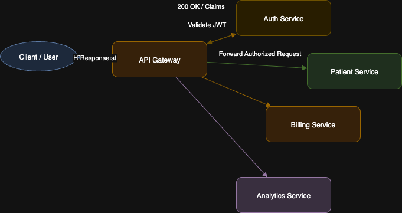
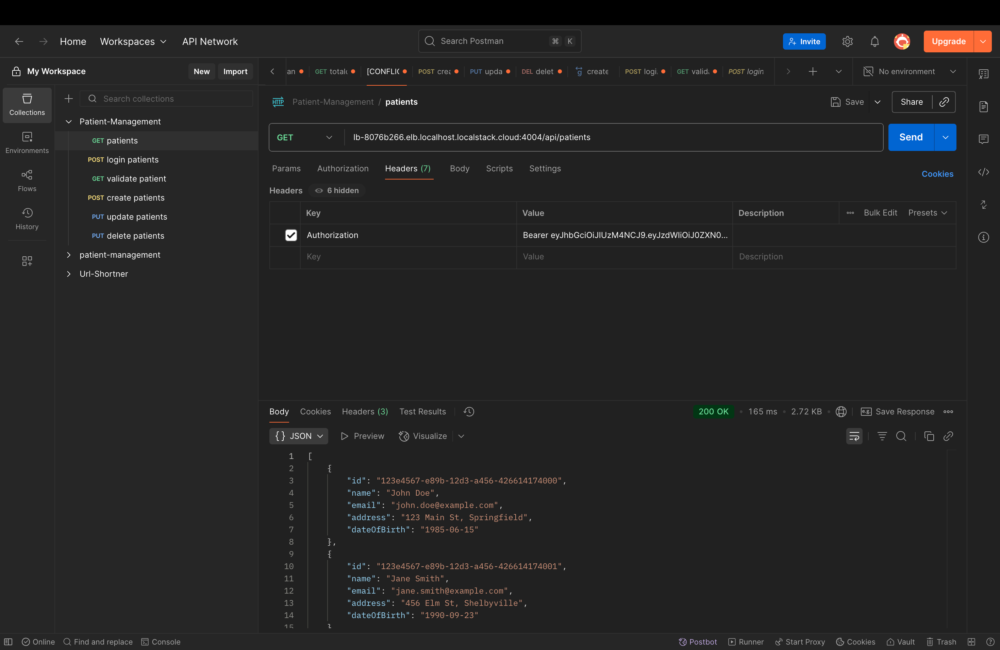

# Healthcare Microservices System


A comprehensive healthcare management platform built on Spring Boot microservices with CQRS in the Appointment domain, event-driven communication using Kafka, gRPC billing, Redis caching, and full observability with Prometheus and Grafana. The stack is containerized and environment-driven via `.env`, and ships with a `docker-compose.yml` for one-command local deployments. Manual `docker run` steps are documented for parity with local development workflows.

---

## System Architecture Overview


##### Link for the image-(https://www.mermaidchart.com/app/projects/a0da8956-4e28-4c70-abc7-549981a70200/diagrams/062c8f2f-d18c-429e-8039-9d4d4379e368/version/v0.1/edit)

The system is decomposed into independently deployable services:

* Patient Service (CRUD + Kafka producer + Redis)
* Appointment Service (CQRS with cached patient projection + Kafka consumer)
* Auth Service (JWT issuance/validation + RBAC)
* Billing Service (gRPC server + event integration)
* Analytics Service (Kafka consumer)
* API Gateway (routing + JWT validation + rate limiting)
* Infrastructure: Kafka, Redis, PostgreSQL databases, Prometheus, Grafana, LocalStack

---

## Table of Contents

* [Core Features](#core-features)
* [Container Ecosystem](#container-ecosystem)
* [Service Architecture](#service-architecture)

    * [Patient Service](#patient-service)
    * [Appointment Service](#appointment-service)
    * [Auth Service](#auth-service)
    * [Billing Service](#billing-service)
    * [Analytics Service](#analytics-service)
    * [API Gateway](#api-gateway)
* [CQRS in Appointment Service](#cqrs-in-appointment-service)

    * [Entities](#entities)
    * [Event Flow](#event-flow)
    * [DTO Enrichment](#dto-enrichment)
    * [Screenshots](#screenshots)
* [API Workflows](#api-workflows)
* [Caching Strategy](#caching-strategy)
* [Rate Limiting & Security](#rate-limiting--security)
* [Resilience Patterns](#resilience-patterns)
* [Event-Driven Architecture](#event-driven-architecture)

    * [Topics](#topics)
    * [Message Contracts](#message-contracts)
    * [Consumer Groups and Offset Management](#consumer-groups-and-offset-management)
* [Observability & Monitoring](#observability--monitoring)

    * [Prometheus](#prometheus)
    * [Grafana](#grafana)
    * [Actuator Endpoints](#actuator-endpoints)
* [Service Discovery & Cloud](#service-discovery--cloud)
* [API Testing](#api-testing)
* [Docker Deployment](#docker-deployment)

    * [Quick Start with Compose](#quick-start-with-compose)
    * [Compose Services Overview](#compose-services-overview)
* [Manual Docker Run Steps](#manual-docker-run-steps)

    * [Databases](#databases)
    * [Infrastructure](#infrastructure)
    * [Application Services](#application-services)
* [Infrastructure & Configuration](#infrastructure--configuration)

    * [Technology Stack](#technology-stack)
    * [Directory Layout](#directory-layout)
    * [Configuration Matrix](#configuration-matrix)
* [Getting Started](#getting-started)
* [Testing the System](#testing-the-system)
* [Environment Variables](#environment-variables)

    * [.env.example](#envexample)
    * [Secrets Policy](#secrets-policy)
* [Service-Specific Setup](#service-specific-setup)

    * [Billing Service gRPC Setup](#billing-service-grpc-setup)
    * [Patient Service gRPC + Kafka Setup](#patient-service-grpc--kafka-setup)
    * [Appointment Service Kafka Listener](#appointment-service-kafka-listener)
    * [Auth Service Dependencies](#auth-service-dependencies)
* [Data Model](#data-model)

    * [DDL Snippets](#ddl-snippets)
* [API Reference](#api-reference)

    * [Patient Service REST](#patient-service-rest)
    * [Appointment Service REST](#appointment-service-rest)
    * [Auth Service REST](#auth-service-rest)
    * [Billing Service gRPC](#billing-service-grpc)
* [Error Handling & Problem Details](#error-handling--problem-details)
* [Pagination & Sorting Standard](#pagination--sorting-standard)
* [Logging & Tracing](#logging--tracing)
* [Performance Tuning](#performance-tuning)
* [Backup & Restore](#backup--restore)
* [Migrations](#migrations)
* [Troubleshooting](#troubleshooting)
* [CI/CD and Versioning](#cicd-and-versioning)
* [Contribution Guide](#contribution-guide)
* [Roadmap](#roadmap)
* [License](#license)

---

## Core Features

* Microservices with Spring Boot 3.2+
* CQRS in the Appointment Service: write model (`appointment`), read model (`cached_patient`), projection updated via Kafka consumer
* Redis caching and read-through access
* Kafka for event-driven workflows and service decoupling
* gRPC (Billing Service) with Protobuf contracts and low-latency calls
* API Gateway with JWT authentication and rate limiting
* Circuit breakers and retries for resilience
* Prometheus & Grafana for metrics, dashboards, and alerting
* LocalStack for AWS service emulation
* `.env` / `.env.example` driven configuration and `docker-compose.yml` for one-command spin-up

---

## Container Ecosystem


| Service                | Port(s)     | Technology                   |
| ---------------------- | ----------- | ---------------------------- |
| patient-service        | 4000        | Spring Boot + JPA + Kafka    |
| appointment-service    | 4006        | Spring Boot + CQRS + Kafka   |
| analytics-service      | 4002        | Spring Boot + Kafka consumer |
| api-gateway            | 4004        | Spring Cloud Gateway         |
| auth-service           | 4005        | Spring Security + JWT        |
| billing-service        | 9001 (gRPC) | gRPC Server + Kafka          |
| redis                  | 6379        | Redis 7                      |
| kafka                  | 9092, 9094  | Bitnami Kafka (KRaft)        |
| prometheus             | 9090        | Prometheus                   |
| grafana                | 3000        | Grafana                      |
| localstack (optional)  | 4566, 443   | Local AWS emulator           |
| postgres (per service) | 5432        | PostgreSQL 15                |

---

## Service Architecture

### Patient Service

* CRUD for patients
* Publishes domain events: `patient.created`, `patient.updated`
* Kafka producer configuration
* gRPC client to billing-service for account provisioning
* PostgreSQL database
* Redis for caching
* Exposes Actuator health, metrics

### Appointment Service

* CQRS implementation
* PostgreSQL with `appointment` and `cached_patient`
* Kafka listener updates projections from patient events
* Enriched DTOs combining appointment + cached patient
* Validation and exception handling with problem details

### Auth Service

* JWT token issuance and validation
* BCrypt hashing
* Roles: ADMIN, USER
* PostgreSQL persistence
* springdoc OpenAPI enabled (UI optional)

### Billing Service

* gRPC microservice
* Protobuf contracts for account creation and billing events
* Kafka consumer/producer where applicable
* Timeouts and retries

### Analytics Service

* Kafka consumer for patient lifecycle events
* Real-time processing pipeline placeholder for sinks and storage

### API Gateway

* Central routing
* JWT validation
* Rate limiting and standard response headers
* CORS policies

---

## CQRS in Appointment Service

The Appointment Service separates writes and reads:

* Write model: store appointments with minimal coupling
* Read model: projection table `cached_patient` updated by a Kafka listener
* Queries join `appointment` with `cached_patient` to produce enriched responses without synchronous cross-service calls

### Entities

* `Appointment`: id, patientId, startTime, endTime, notes, status
* `CachedPatient`: patientId, name, email, phone, address, updatedAt

### Event Flow

1. Patient created or updated in Patient Service
2. Event published to Kafka (`patient.created` or `patient.updated`)
3. Appointment Service Kafka listener consumes event
4. Projection (`cached_patient`) upserted
5. GET endpoints on Appointment Service fetch enriched DTOs directly from local DB

### DTO Enrichment

Responses include both appointment details and the latest cached patient fields, avoiding N+1 calls or tight coupling.

### Screenshots

* Get Appointments (CQRS read model):


* Update Patient → event → projection updated:
  

* Kafka Topics:
*   


* Cached Patient table + logs:
* updated name and email again = hello from patient service 1
  

---

## API Workflows

* Patients: CRUD via Patient Service or API Gateway
* Appointments: create/update/list enriched with cached patient data
* Auth: login to receive JWT; include `Authorization: Bearer <token>` for protected endpoints
* Billing: gRPC call from Patient Service on patient creation
* Analytics: consumes patient events for insights

  

---

## Caching Strategy

* Redis for caching frequently accessed data
* Read-through strategy: first miss populates cache
* Eviction on patient update events using topic subscription
* Prometheus counters for hit/miss by cache name and key pattern

---

## Rate Limiting & Security

* API Gateway enforces token validation and per-endpoint quotas
* Role-based access in Auth Service
* BCrypt password hashing, salted
* CORS configuration for dev clients
* Security headers: HSTS, X-Content-Type-Options, X-XSS-Protection where applicable

---

## Resilience Patterns

* Circuit breakers around gRPC calls and downstream integrations
* Retry policies for transient Kafka failures
* Timeouts and bulkheads to avoid cascade failures
* Dead letter handling for poisoned messages (pattern described below)
  

---

## Event-Driven Architecture

### Topics

* `patient.created`
* `patient.updated`
* `billing-account`

### Message Contracts

Example `patient.updated` message:

```json
{
  "eventId": "d94a4b4c-5ca6-4e76-8d5a-9b2b705a5a30",
  "type": "patient.updated",
  "occurredAt": "2025-09-10T11:22:33Z",
  "data": {
    "patientId": "f0a8c1f7-4e92-4205-88f8-3f0497bb1c2a",
    "name": "John Doe",
    "email": "john@example.com",
    "phone": "+1-555-0102",
    "address": "123 Main St",
    "attributes": {
      "gender": "M",
      "dob": "1990-01-01"
    }
  }
}
```

If you later adopt a Schema Registry, capture compatible evolution rules here (backward compatible changes to `data`).

### Consumer Groups and Offset Management

* Appointment Service runs in consumer group `appointments-cg`
* Auto offset commit with at-least-once processing
* For idempotent upsert on `cached_patient`, use unique constraint on patientId

---

## Observability & Monitoring

### Prometheus


* Scrapes Spring Boot Actuator `/actuator/prometheus`
* Collects JVM, HTTP, DB pool, cache, and Kafka client metrics
* Prometheus configuration is bind-mounted from the repo

### Grafana

* Default Spring dashboards: JVM, HTTP latency, throughput, DB connections
  
* Custom dashboards: cache hit/miss, CQRS latency, consumer lag
  

### Actuator Endpoints

* `/actuator/health`
* `/actuator/metrics`
* `/actuator/prometheus`
* `/actuator/info`
* Sensitive endpoints can be toggled in properties per service

---

## Service Discovery & Cloud

Local development uses Docker’s internal network for discovery. For cloud environments, consider:

* AWS Cloud Map for service naming
* Elastic Load Balancing and Service Mesh options
* MSK for managed Kafka
* RDS for managed Postgres
* ElastiCache for managed Redis
* The repo includes LocalStack to emulate AWS components locally (optional)
  
*   


---

## API Testing

Postman collections cover:

* Patient CRUD
* Appointment lifecycle
* Auth flows (login, token validation)
* Event-driven scenarios



---

## Docker Deployment

### Quick Start with Compose

1. Create `.env` from the template:

```bash
cp .env.example .env
```

2. Build all services:

```bash
mvn clean package -DskipTests
```

3. Start the entire stack:

```bash
docker compose up -d
```

4. Verify health:

```bash
curl http://localhost:4000/actuator/health
curl http://localhost:4006/actuator/health
curl http://localhost:4005/actuator/health
```

### Compose Services Overview

* `docker-compose.yml` lives at the repo root
* All sensitive values and ports are read from `.env`
* Volumes persist Postgres data under `./databases/*`
* Prometheus loads configuration from `./monitoring/prometheus.yml` (bind mount)

---

## Manual Docker Run Steps

If you prefer granular control or need to mirror your IntelliJ Docker configurations, use these commands. They assume the `.env` values shown later and the default internal network name `internal`.

### Databases

Patient DB:

```bash
docker run -d \
  --name patient-service-db \
  --network internal \
  -p 5001:5432 \
  -v ./databases/patient-service-db:/var/lib/postgresql/data \
  -e POSTGRES_USER=admin_user \
  -e POSTGRES_PASSWORD=password \
  -e POSTGRES_DB=db \
  postgres:latest
```

Appointment DB:

```bash
docker run -d \
  --name appointment-service-db \
  --network internal \
  -p 5004:5432 \
  -v ./databases/appointment-service-db:/var/lib/postgresql/data \
  -e POSTGRES_USER=admin_user \
  -e POSTGRES_PASSWORD=password \
  -e POSTGRES_DB=db \
  postgres:latest
```

Auth DB:

```bash
docker run -d \
  --name auth-service-db \
  --network internal \
  -p 5002:5432 \
  -v ./databases/auth-service-db:/var/lib/postgresql/data \
  -e POSTGRES_USER=admin_user \
  -e POSTGRES_PASSWORD=password \
  -e POSTGRES_DB=db \
  postgres:latest
```

### Infrastructure

Redis:

```bash
docker run -d \
  --name redis \
  --network internal \
  -p 6379:6379 \
  redis:latest
```

Kafka:

```bash
docker run -d \
  --name kafka \
  --network internal \
  -p 9092:9092 -p 9094:9094 \
  -e KAFKA_CFG_ADVERTISED_LISTENERS=PLAINTEXT://kafka:9092,EXTERNAL://localhost:9094 \
  -e KAFKA_CFG_CONTROLLER_LISTENER_NAMES=CONTROLLER \
  -e KAFKA_CFG_CONTROLLER_QUORUM_VOTERS=0@kafka:9093 \
  -e KAFKA_CFG_LISTENER_SECURITY_PROTOCOL_MAP=CONTROLLER:PLAINTEXT,EXTERNAL:PLAINTEXT,PLAINTEXT:PLAINTEXT \
  -e KAFKA_CFG_LISTENERS=PLAINTEXT://:9092,CONTROLLER://:9093,EXTERNAL://:9094 \
  -e KAFKA_CFG_NODE_ID=0 \
  -e KAFKA_CFG_PROCESS_ROLES=controller,broker \
  bitnami/kafka:latest
```

Prometheus:

```bash
docker run -d \
  --name prometheus \
  --network internal \
  -p 9090:9090 \
  -v ./monitoring/prometheus.yml:/etc/prometheus/prometheus.yml \
  prom/prometheus:latest
```

Grafana:

```bash
docker run -d \
  --name grafana \
  --network internal \
  -p 3000:3000 \
  grafana/grafana:latest
```

LocalStack (optional):

```bash
docker run -d \
  --name localstack \
  --network internal \
  -p 4566:4566 -p 443:443 \
  -e SERVICES="s3,sqs,sns,dynamodb,cloudmap,elasticache" \
  -e DEBUG=1 \
  localstack/localstack:latest
```

### Application Services

Build each image first:

```bash
docker build -t patient-service:latest ./patient-service
docker build -t appointment-service:latest ./appointment-service
docker build -t auth-service:latest ./auth-service
docker build -t api-gateway:latest ./api-gateway
docker build -t billing-service:latest ./billing-service
docker build -t analytics-service:latest ./analytics-service
```

Patient Service:

```bash
docker run -d \
  --name patient-service \
  --network internal \
  -p 4000:4000 \
  -e SPRING_DATASOURCE_URL=jdbc:postgresql://patient-service-db:5432/db \
  -e SPRING_DATASOURCE_USERNAME=admin_user \
  -e SPRING_DATASOURCE_PASSWORD=password \
  -e SPRING_JPA_HIBERNATE_DDL_AUTO=update \
  -e SPRING_KAFKA_BOOTSTRAP_SERVERS=kafka:9092 \
  -e SPRING_CACHE_TYPE=redis \
  -e SPRING_DATA_REDIS_HOST=redis \
  -e SPRING_DATA_REDIS_PORT=6379 \
  -e BILLING_SERVICE_ADDRESS=billing-service \
  -e BILLING_SERVICE_GRPC_PORT=9001 \
  patient-service:latest
```

Appointment Service:

```bash
docker run -d \
  --name appointment-service \
  --network internal \
  -p 4006:4006 \
  -e SPRING_DATASOURCE_URL=jdbc:postgresql://appointment-service-db:5432/db \
  -e SPRING_DATASOURCE_USERNAME=admin_user \
  -e SPRING_DATASOURCE_PASSWORD=password \
  -e SPRING_JPA_HIBERNATE_DDL_AUTO=update \
  -e SPRING_KAFKA_BOOTSTRAP_SERVERS=kafka:9092 \
  -e SPRING_SQL_INIT_MODE=always \
  -e SPRING_CACHE_TYPE=redis \
  -e SPRING_DATA_REDIS_HOST=redis \
  -e SPRING_DATA_REDIS_PORT=6379 \
  appointment-service:latest
```

Auth Service:

```bash
docker run -d \
  --name auth-service \
  --network internal \
  -p 4005:4005 \
  -e JWT_SECRET=replace-me-secret \
  -e SPRING_DATASOURCE_URL=jdbc:postgresql://auth-service-db:5432/db \
  -e SPRING_DATASOURCE_USERNAME=admin_user \
  -e SPRING_DATASOURCE_PASSWORD=password \
  -e SPRING_JPA_HIBERNATE_DDL_AUTO=update \
  -e SPRING_SQL_INIT_MODE=always \
  auth-service:latest
```

API Gateway:

```bash
docker run -d \
  --name api-gateway \
  --network internal \
  -p 4004:4004 \
  -e AUTH_SERVICE_URL=http://auth-service:4005 \
  api-gateway:latest
```

Billing Service:

```bash
docker run -d \
  --name billing-service \
  --network internal \
  -p 4001:4001 -p 9001:9001 \
  -e SPRING_KAFKA_BOOTSTRAP_SERVERS=kafka:9092 \
  billing-service:latest
```

Analytics Service:

```bash
docker run -d \
  --name analytics-service \
  --network internal \
  -p 4002:4002 \
  -e SPRING_KAFKA_BOOTSTRAP_SERVERS=kafka:9092 \
  analytics-service:latest
```

---

## Infrastructure & Configuration

### Technology Stack

* Java 17
* Spring Boot 3.2+
* PostgreSQL 15
* Redis 7
* Kafka 3.4 (Bitnami KRaft single node)
* Prometheus + Grafana
* Docker / Docker Compose
* LocalStack (optional)

### Directory Layout

```
patient-management/
├─ api-gateway/
├─ patient-service/
├─ appointment-service/
├─ billing-service/
├─ analytics-service/
├─ auth-service/
├─ monitoring/
│  └─ prometheus.yml
├─ databases/
│  ├─ patient-service-db/
│  ├─ appointment-service-db/
│  └─ auth-service-db/
├─ screenshots/
│  ├─ img.png
│  ├─ docker.png
│  ├─ prometheus-ui.png
│  ├─ grafana-default.png
│  ├─ grafana-custom1.png
│  ├─ postman.png
│  ├─ localstack.png
│  ├─ testing1.png
│  ├─ testing2.png
│  ├─ testing3.png
│  └─ testing4.png
├─ docker-compose.yml
├─ .env.example
└─ README.md
```

### Configuration Matrix

| Area       | Key                                                                                                                                                | Source |
| ---------- | -------------------------------------------------------------------------------------------------------------------------------------------------- | ------ |
| Ports      | `PATIENT_SERVICE_PORT`, `AUTH_SERVICE_PORT`, `APPOINTMENT_SERVICE_PORT`, `ANALYTICS_SERVICE_PORT`, `BILLING_SERVICE_GRPC_PORT`, `API_GATEWAY_PORT` | `.env` |
| Kafka      | `KAFKA_CFG_*`, `SPRING_KAFKA_BOOTSTRAP_SERVERS`                                                                                                    | `.env` |
| Redis      | `REDIS_HOST`, `REDIS_PORT`, `SPRING_CACHE_TYPE`                                                                                                    | `.env` |
| DBs        | Postgres creds and URLs per service                                                                                                                | `.env` |
| Auth       | `JWT_SECRET`                                                                                                                                       | `.env` |
| Prometheus | `PROMETHEUS_CONFIG_LOCAL`, `PROMETHEUS_CONFIG_CONTAINER`                                                                                           | `.env` |

---

## Getting Started

```bash
git clone <repo-url>
cd patient-management
cp .env.example .env
mvn clean package -DskipTests
docker compose up -d
```

Check health:

```bash
curl http://localhost:4000/actuator/health
curl http://localhost:4006/actuator/health
curl http://localhost:4005/actuator/health
```

---

## Testing the System

1. Authenticate
2. Create Patient (emits `patient.created`)
3. Update Patient (emits `patient.updated`)
4. Create Appointment → read model enriches DTO from `cached_patient`

---

## Environment Variables

Centralized in `.env`, not committed. `.env.example` provides safe placeholders.

### .env.example

```bash
# -------------------------
# Network
# -------------------------
DOCKER_NETWORK=internal

# -------------------------
# Global JVM (optional)
# -------------------------
JAVA_TOOL_OPTIONS=-agentlib:jdwp=transport=dt_socket,server=y,suspend=n,address=*:5005

# -------------------------
# Ports
# -------------------------
PATIENT_SERVICE_PORT=4000
APPOINTMENT_SERVICE_PORT=4006
ANALYTICS_SERVICE_PORT=4002
API_GATEWAY_PORT=4004
AUTH_SERVICE_PORT=4005
BILLING_SERVICE_HTTP_PORT=4001
BILLING_SERVICE_GRPC_PORT=9001
GRAFANA_PORT=3000
PROMETHEUS_PORT=9090
REDIS_PORT=6379

# -------------------------
# Redis
# -------------------------
REDIS_HOST=redis
SPRING_CACHE_TYPE=redis

# -------------------------
# Kafka (Bitnami single node KRaft)
# -------------------------
SPRING_KAFKA_BOOTSTRAP_SERVERS=kafka:9092
KAFKA_CFG_ADVERTISED_LISTENERS=PLAINTEXT://kafka:9092,EXTERNAL://localhost:9094
KAFKA_CFG_CONTROLLER_LISTENER_NAMES=CONTROLLER
KAFKA_CFG_CONTROLLER_QUORUM_VOTERS=0@kafka:9093
KAFKA_CFG_LISTENER_SECURITY_PROTOCOL_MAP=CONTROLLER:PLAINTEXT,EXTERNAL:PLAINTEXT,PLAINTEXT:PLAINTEXT
KAFKA_CFG_LISTENERS=PLAINTEXT://:9092,CONTROLLER://:9093,EXTERNAL://:9094
KAFKA_CFG_NODE_ID=0
KAFKA_CFG_PROCESS_ROLES=controller,broker

# -------------------------
# Postgres (per-service DBs)
# -------------------------
POSTGRES_USER=admin_user
POSTGRES_PASSWORD=password
POSTGRES_DB=db

# Patient DB URL (used by patient-service)
PATIENT_DB_URL=jdbc:postgresql://patient-service-db:5432/db
PATIENT_DB_USER=admin_user
PATIENT_DB_PASSWORD=password

# Appointment DB URL (used by appointment-service inline)
# jdbc:postgresql://appointment-service-db:5432/db

# Auth DB URL (used by auth-service inline)
# jdbc:postgresql://auth-service-db:5432/db

# -------------------------
# Auth
# -------------------------
JWT_SECRET=replace-me-secret

# -------------------------
# Inter-service addresses
# -------------------------
BILLING_SERVICE_ADDRESS=billing-service

# -------------------------
# Prometheus bind mount
# -------------------------
PROMETHEUS_CONFIG_LOCAL=./monitoring/prometheus.yml
PROMETHEUS_CONFIG_CONTAINER=/etc/prometheus/prometheus.yml
```

### Secrets Policy

* Never commit `.env`
* Commit `.env.example`
* Rotate JWT secrets and DB passwords before any public demo
* Prefer Docker secrets / cloud secret managers in production

---

## Service-Specific Setup

### Billing Service gRPC Setup

Add to `pom.xml`:

```xml
<dependency>
  <groupId>io.grpc</groupId>
  <artifactId>grpc-netty-shaded</artifactId>
  <version>1.69.0</version>
</dependency>
<dependency>
  <groupId>io.grpc</groupId>
  <artifactId>grpc-protobuf</artifactId>
  <version>1.69.0</version>
</dependency>
<dependency>
  <groupId>io.grpc</groupId>
  <artifactId>grpc-stub</artifactId>
  <version>1.69.0</version>
</dependency>
<dependency>
  <groupId>org.apache.tomcat</groupId>
  <artifactId>annotations-api</artifactId>
  <version>6.0.53</version>
  <scope>provided</scope>
</dependency>
<dependency>
  <groupId>com.google.protobuf</groupId>
  <artifactId>protobuf-java</artifactId>
  <version>4.29.1</version>
</dependency>
```

Protobuf plugin:

```xml
<plugin>
  <groupId>org.xolstice.maven.plugins</groupId>
  <artifactId>protobuf-maven-plugin</artifactId>
  <version>0.6.1</version>
  <configuration>
    <protocArtifact>com.google.protobuf:protoc:3.25.5:exe:${os.detected.classifier}</protocArtifact>
    <pluginId>grpc-java</pluginId>
    <pluginArtifact>io.grpc:protoc-gen-grpc-java:1.68.1:exe:${os.detected.classifier}</pluginArtifact>
  </configuration>
  <executions>
    <execution>
      <goals>
        <goal>compile</goal>
        <goal>compile-custom</goal>
      </goals>
    </execution>
  </executions>
</plugin>
```

### Patient Service gRPC + Kafka Setup

Same gRPC dependencies as above plus Kafka:

```xml
<dependency>
  <groupId>org.springframework.kafka</groupId>
  <artifactId>spring-kafka</artifactId>
  <version>3.3.0</version>
</dependency>
```

Consumer config (when applicable):

```properties
spring.kafka.consumer.key-deserializer=org.apache.kafka.common.serialization.StringDeserializer
spring.kafka.consumer.value-deserializer=org.apache.kafka.common.serialization.ByteArrayDeserializer
```

### Appointment Service Kafka Listener

* Subscribes to `patient.created`, `patient.updated`
* Upserts `cached_patient` by `patientId`
* Idempotent logic to support at-least-once delivery

### Auth Service Dependencies

```xml
<dependency>
  <groupId>org.springframework.boot</groupId>
  <artifactId>spring-boot-starter-security</artifactId>
</dependency>
<dependency>
  <groupId>org.springframework.boot</groupId>
  <artifactId>spring-boot-starter-data-jpa</artifactId>
</dependency>
<dependency>
  <groupId>org.springframework.boot</groupId>
  <artifactId>spring-boot-starter-web</artifactId>
</dependency>
<dependency>
  <groupId>io.jsonwebtoken</groupId>
  <artifactId>jjwt-api</artifactId>
  <version>0.12.6</version>
</dependency>
<dependency>
  <groupId>io.jsonwebtoken</groupId>
  <artifactId>jjwt-impl</artifactId>
  <version>0.12.6</version>
  <scope>runtime</scope>
</dependency>
<dependency>
  <groupId>io.jsonwebtoken</groupId>
  <artifactId>jjwt-jackson</artifactId>
  <version>0.12.6</version>
  <scope>runtime</scope>
</dependency>
<dependency>
  <groupId>org.postgresql</groupId>
  <artifactId>postgresql</artifactId>
  <scope>runtime</scope>
</dependency>
<dependency>
  <groupId>org.springdoc</groupId>
  <artifactId>springdoc-openapi-starter-webmvc-ui</artifactId>
  <version>2.6.0</version>
</dependency>
```

---

## Data Model

### DDL Snippets

`appointment`:

```sql
CREATE TABLE IF NOT EXISTS appointment (
  id UUID PRIMARY KEY,
  patient_id UUID NOT NULL,
  start_time TIMESTAMP NOT NULL,
  end_time TIMESTAMP NOT NULL,
  notes TEXT,
  status VARCHAR(32) NOT NULL DEFAULT 'SCHEDULED',
  created_at TIMESTAMP NOT NULL DEFAULT NOW(),
  updated_at TIMESTAMP NOT NULL DEFAULT NOW()
);
CREATE INDEX IF NOT EXISTS idx_appointment_patient_id ON appointment(patient_id);
```

`cached_patient`:

```sql
CREATE TABLE IF NOT EXISTS cached_patient (
  patient_id UUID PRIMARY KEY,
  name VARCHAR(255),
  email VARCHAR(255),
  phone VARCHAR(64),
  address VARCHAR(255),
  updated_at TIMESTAMP NOT NULL DEFAULT NOW()
);
```

`users` (Auth Service):

```sql
CREATE TABLE IF NOT EXISTS "users" (
  id UUID PRIMARY KEY,
  email VARCHAR(255) UNIQUE NOT NULL,
  password VARCHAR(255) NOT NULL,
  role VARCHAR(50) NOT NULL
);
```

---

## API Reference

### Patient Service REST

```
GET    /patients
GET    /patients/{id}
POST   /patients
PUT    /patients/{id}
DELETE /patients/{id}
```

Query parameters support pagination: `page`, `size`, `sort=name,asc`.

Sample create:

```http
POST /patients
Content-Type: application/json

{
  "name": "John Doe",
  "email": "john@example.com",
  "address": "123 Main St",
  "dateOfBirth": "1990-01-01"
}
```

### Appointment Service REST

```
GET    /appointments?from=2025-05-20T00:00:00&to=2025-05-25T23:59:59
GET    /appointments/{id}
POST   /appointments
PUT    /appointments/{id}
DELETE /appointments/{id}
```

Returns enriched DTOs with cached patient info.

### Auth Service REST

```
POST /auth/login
POST /auth/register
GET  /auth/me
```

Include `Authorization: Bearer <token>` in protected routes.

### Billing Service gRPC

`billing.proto` (illustrative):

```proto
syntax = "proto3";

package billing;

message CreateAccountRequest {
  string patientId = 1;
  string email = 2;
  string name = 3;
}

message CreateAccountResponse {
  string accountId = 1;
  string status = 2; // CREATED, EXISTS
}

service BillingService {
  rpc CreateAccount(CreateAccountRequest) returns (CreateAccountResponse);
}
```

---

## Error Handling & Problem Details

Standardize on RFC 7807:

```json
{
  "type": "https://example.com/errors/validation",
  "title": "Validation Failed",
  "status": 400,
  "detail": "name must not be blank",
  "instance": "/appointments"
}
```

---

## Pagination & Sorting Standard

Requests:

```
GET /patients?page=0&size=10&sort=name,asc
```

Responses:

```json
{
  "content": [...],
  "page": 0,
  "size": 10,
  "totalElements": 25,
  "totalPages": 3,
  "sort": ["name,asc"],
  "hasNext": true,
  "hasPrevious": false
}
```

---

## Logging & Tracing

* JSON logging recommended in production
* Correlate requests with trace IDs via filters
* Log key events: patient updated, event published, projection updated

---

## Performance Tuning

* JVM: set heap via `JAVA_TOOL_OPTIONS`
* DB: indexes on foreign keys and query filters
* Kafka: tune batch sizes, linger.ms for producers
* Redis: set TTL for caches; monitor hit/miss

---

## Backup & Restore

* Postgres volumes under `./databases/*`
* Use `pg_dump` for backups
* Consider point-in-time recovery in production

---

## Migrations

* Recommended: Flyway or Liquibase per service
* Track DDL evolution for `appointment` and `cached_patient`

---

## Troubleshooting

* Kafka listener start failure: verify `SPRING_KAFKA_BOOTSTRAP_SERVERS` and container health
* DB connection refused: ensure `${service}-db` is up and mapped to `:5432`
* Prometheus targets down: check bind mount `./monitoring/prometheus.yml` → `/etc/prometheus/prometheus.yml`
* Redis connection errors: confirm `REDIS_HOST=redis`, `REDIS_PORT=6379`, and container is reachable on network
* JWT validation failed: ensure `JWT_SECRET` matches issuer

Diagnostics:

```bash
docker compose ps
docker compose logs -f kafka
docker compose logs -f patient-service
docker exec -it patient-service-db psql -U admin_user -d db -c '\dt'
```

---

## CI/CD and Versioning

* Suggested: GitHub Actions for build/test
* Tag releases with semantic versioning
* Build images and push to a registry per service

Example GitHub Actions snippet:

```yaml
name: CI
on: [push, pull_request]
jobs:
  build:
    runs-on: ubuntu-22.04
    steps:
      - uses: actions/checkout@v4
      - uses: actions/setup-java@v4
        with:
          distribution: temurin
          java-version: '17'
      - run: mvn -B -DskipTests clean package
```

---

## Contribution Guide

* Use feature branches
* Write unit and integration tests
* Follow conventional commits
* Run `mvn -DskipTests=false test` before PRs
* Keep README and `.env.example` updated

---

## Roadmap

* Notification Service with templated events
* Saga orchestration for multi-service workflows
* Kubernetes Helm charts
* Schema Registry and contract testing for Kafka
* OpenTelemetry tracing

---

## License

MIT `LICENSE`.

---

## Docker Compose Setup (Reference)

The `docker-compose.yml` is committed at the repository root and reads configuration from `.env`. Typical workflow:

```bash
cp .env.example .env
mvn clean package -DskipTests
docker compose up -d
```

Shut down:

```bash
docker compose down
```

Reset data:

```bash
docker compose down -v
```

---

## Host-Specific Notes

If you prefer an absolute macOS bind mount for Prometheus (development only), the following mapping is supported:

```
/Users/<you>/code/patient-management/monitoring/prometheus.yml:/etc/prometheus/prometheus.yml
```

The committed Compose file uses the relative path form:

```
${PROMETHEUS_CONFIG_LOCAL}:${PROMETHEUS_CONFIG_CONTAINER}
```

Update `.env` accordingly if you switch between absolute and relative mounts.

---

**Copyright © 2025 Sandip Mandal**

*This healthcare microservices system demonstrates enterprise-grade patterns including observability, resilience, caching, and event-driven architecture. The system is designed for production deployment with comprehensive monitoring, security, and scalability features.*

---

